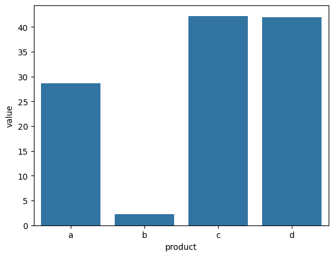
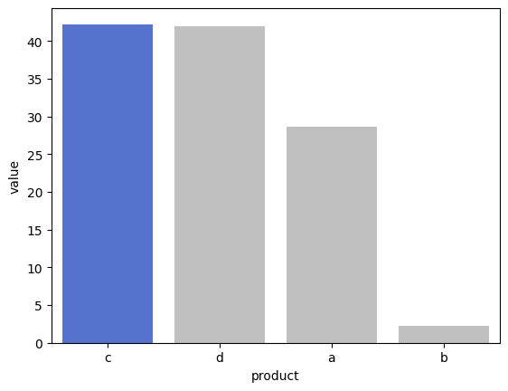
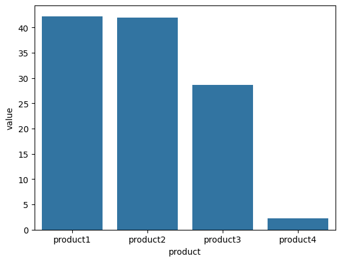

## Categorical Data

**Categorical Variables**
* take on a limited, and usually fixed, number of possible values
* might have an order
* numerical operations are not possible


```python
import numpy as np
import pandas as pd
import matplotlib.pyplot as plt
import seaborn as sns
```


```python
s = pd.Series(['a','b','c','d', 'a'], dtype = 'category')
s
```


    0    a
    1    b
    2    c
    3    d
    4    a
    dtype: category
    Categories (4, object): ['a', 'b', 'c', 'd']


```python
s2 = pd.Series(['a','b','c','d'], name = 'product')
s3 = pd.Series([28.67, 2.24, 42.22, 41.93], name = 'value')
df = pd.concat([s2,s3], axis = 1)
df.head()
```


<table border="1" class="dataframe">
  <thead>
    <tr style="text-align: right;">
      <th></th>
      <th>product</th>
      <th>value</th>
    </tr>
  </thead>
  <tbody>
    <tr>
      <th>0</th>
      <td>a</td>
      <td>28.67</td>
    </tr>
    <tr>
      <th>1</th>
      <td>b</td>
      <td>2.24</td>
    </tr>
    <tr>
      <th>2</th>
      <td>c</td>
      <td>42.22</td>
    </tr>
    <tr>
      <th>3</th>
      <td>d</td>
      <td>41.93</td>
    </tr>
  </tbody>
</table>


```python
df.dtypes
```


    product     object
    value      float64
    dtype: object


```python
df['product'] = df['product'].astype('category')
df.dtypes
```


    product    category
    value       float64
    dtype: object


```python
sns.barplot(data = df, x = 'product', y = 'value')
plt.show()
```


    

    


### Sorting categories for plotting
---
* Sort the dataframe by the column you wish to order the plot by
* Extract the, now ordered, categorical column to a list
* Pass that list to the `reorder_categories()` method to update the categories for the column


```python
sort_order = list(df.sort_values(by = 'value', ascending = False)['product'])
sort_order
```


    ['c', 'd', 'a', 'b']


```python
df['product'] = df['product'].cat.reorder_categories(sort_order)
df['product'] # the order of the categories is updated
```


    0    a
    1    b
    2    c
    3    d
    Name: product, dtype: category
    Categories (4, object): ['c', 'd', 'a', 'b']


* New categorical data are not automatically ordered
* Even after using the `reorder_categories()` method, the ordered variable is still `False`
    * You can set the `ordered` argument to `True` in the `reorder_categories()` method


```python
df['product'].cat.ordered
```


    False


```python
sns.barplot(data = df, x = 'product', y = 'value')
plt.show()
```


    

    


#### Color coding columns


```python
df['is_max'] = (df['value'] == df['value'].max())
df.head()
```


<table border="1" class="dataframe">
  <thead>
    <tr style="text-align: right;">
      <th></th>
      <th>product</th>
      <th>value</th>
      <th>is_max</th>
    </tr>
  </thead>
  <tbody>
    <tr>
      <th>0</th>
      <td>a</td>
      <td>28.67</td>
      <td>False</td>
    </tr>
    <tr>
      <th>1</th>
      <td>b</td>
      <td>2.24</td>
      <td>False</td>
    </tr>
    <tr>
      <th>2</th>
      <td>c</td>
      <td>42.22</td>
      <td>True</td>
    </tr>
    <tr>
      <th>3</th>
      <td>d</td>
      <td>41.93</td>
      <td>False</td>
    </tr>
  </tbody>
</table>


```python
my_palette = ['silver', 'royalblue']

sns.barplot(data = df, 
            x = 'product', 
            y = 'value', 
            hue = 'is_max', 
            palette = my_palette, 
            legend = None)
plt.show()
```


    

    


### Rename categories
---
* use the `rename_categories()` method
* since the categories were reordered in the order c, d, a, b that appears to be how they were renamed
* This is probably not ideal
    * Categories should be renamed before they are re-ordered


```python
df['product'] = df['product'].cat.rename_categories(['product1', 'product2', 'product3', 'product4'])
df
```


<table border="1" class="dataframe">
  <thead>
    <tr style="text-align: right;">
      <th></th>
      <th>product</th>
      <th>value</th>
      <th>is_max</th>
    </tr>
  </thead>
  <tbody>
    <tr>
      <th>0</th>
      <td>product3</td>
      <td>28.67</td>
      <td>False</td>
    </tr>
    <tr>
      <th>1</th>
      <td>product4</td>
      <td>2.24</td>
      <td>False</td>
    </tr>
    <tr>
      <th>2</th>
      <td>product1</td>
      <td>42.22</td>
      <td>True</td>
    </tr>
    <tr>
      <th>3</th>
      <td>product2</td>
      <td>41.93</td>
      <td>False</td>
    </tr>
  </tbody>
</table>


```python
sns.barplot(data = df, x = 'product', y = 'value')
plt.show()
```


    

    


### Adding and removing categories
---


```python
df['product'].cat.categories
```


    Index(['product1', 'product2', 'product3', 'product4'], dtype='object')


```python
df['product'] = df['product'].cat.add_categories(['product5'])
df['product'].cat.categories
```


    Index(['product1', 'product2', 'product3', 'product4', 'product5'], dtype='object')


```python
df['product'] = df['product'].cat.remove_categories(['product5'])
df['product'].cat.categories
```


    Index(['product1', 'product2', 'product3', 'product4'], dtype='object')


```python
df['product'] = df['product'].cat.add_categories(['product5', 'product6', 'product7', 'product8', 'product9'])
print(df['product'].cat.categories)
df['product'] = df['product'].cat.remove_unused_categories()
print(df['product'].cat.categories)
```

    Index(['product1', 'product2', 'product3', 'product4', 'product5', 'product6',
           'product7', 'product8', 'product9'],
          dtype='object')
    Index(['product1', 'product2', 'product3', 'product4'], dtype='object')


### Set categorical data to be ordered or unordered
---
* the `ordered` argument can be set when using the `reorder_categories()` method as well


```python
df['product'].cat.as_ordered() # this doesn't change dataframe without reassignment
```


    0    product3
    1    product4
    2    product1
    3    product2
    Name: product, dtype: category
    Categories (4, object): ['product1' < 'product2' < 'product3' < 'product4']


```python
df['product'].cat.as_unordered() # default way categorical data would be created
```


    0    product3
    1    product4
    2    product1
    3    product2
    Name: product, dtype: category
    Categories (4, object): ['product1', 'product2', 'product3', 'product4']


