# Data Visualization (Basic Graphs)

## Table of Contents
* [Sample Datasets](#sample-datasets)
* [Most Commonly Used Plot Types](#most-commonly-used-plot-types)
    * [Scatter plot](#scatter-plot)
    * [Line Plots](#line-plots)
    * [Bar Plot](#bar-plot)
        * [Horizontal bar plot](#horizontal-bar-plot)
        * [Grouped Bar Plot](#grouped-bar-plot)
        * [Stacked bar chart](#stacked-bar-chart)
    * [Count Plot](#count-plot)
    * [Histogram](#histogram)
    * [Density Plot](#density-plot)
    * [Box Plot](#box-plot)
    * [Violin Plot](#violin-plot)
    * [Heatmap](#heatmap)
* [Group plots](#group-plots)
    * [Pair Plots](#pair-plots)
    * [Joint plot](#joint-plot)
    * [Facet Grids](#facet-grids)
    * [Subplots](#subplots)
    * [relplot](#relplot)
* [Customizing With Matplotlib](#customizing-with-matplotlib)
    * [Adjust Plot Size](#adjust-plot-size)
    * [Create Figure And Axis With Matplotlib](#create-figure-and-axis-with-matplotlib)
    * [Plot With Seaborn - Specifying The Axis](#plot-with-seaborn---specifying-the-axis)
    * [Customize with Matplotlib (Referencing Axis)](#customize-with-matplotlib-referencing-axis)
    * [Customize with Matplotlib (No Axis)](#customize-with-matplotlib-no-axis)
    * [Add annotations](#add-annotations)
    * [Annotate Text Above A Barplot](#annotate-text-above-a-barplot)
    * [Place Legend Outside The Plot To The Right](#place-legend-outside-the-plot-to-the-right)
    * [Add text outside the plot](#add-text-outside-the-plot)
    * [Save Image](#save-image)
* [Color palettes](#color-palettes)
    * [Display the hexadecimal value of the first color of the current palette](#display-the-hexadecimal-value-of-the-first-color-of-the-current-palette)
    * [Create a custom palette](#create-a-custom-palette)
    * [Use an included palette](#use-an-included-palette)

---


```python
import numpy as np
import pandas as pd
import matplotlib.pyplot as plt
import seaborn as sns
```

## Sample Datasets
* can be loaded with the `load_data_set()` method    
    * `tips`
        * Contains information about restaurant bills and tips.
    * `iris`
        * A classic dataset for classifying Iris flower species based on measurements.
    * `flights`
        * Records monthly passenger numbers on flights.
    * `penguins`
        * Data on different penguin species and their characteristics.
    * `titanic`
        * Contains survival data from the Titanic disaster.
    * `diamonds`
        * Provides details about diamond properties, including price, cut, and clarity.
    * `exercise`
        * Explores the relationship between exercise and various health metrics.


```python
sns.get_dataset_names() # display available datasets
```


    ['anagrams',
     'anscombe',
     'attention',
     'brain_networks',
     'car_crashes',
     'diamonds',
     'dots',
     'dowjones',
     'exercise',
     'flights',
     'fmri',
     'geyser',
     'glue',
     'healthexp',
     'iris',
     'mpg',
     'penguins',
     'planets',
     'seaice',
     'taxis',
     'tips',
     'titanic']


---

## Most Commonly Used Plot Types
* **Scatter**
    * relationship between two variables
    * `scatterplot()` function
* **Line**
    * trend of a variable over time
    * `lineplot()` function
* **Histogram**
    * distribution of a variable
    * `histplot()` function
* **Box**
    * distribution of a variable
    * `boxplot()` function
* **Violin**
    * similar to a box plot
    * provides a more detailed view of the distribution of the data
    * `violinplot()` function
* **Heatmap**
    * correlation between different variables
    * `heatmap()` function
* **Pairplot**
    * relationship between multiple variables
    * `pairplot()` function


### Scatter plot
* used to visualize the relationship between two continuous variables
* each point on the plot represents a single data point


```python
tips = sns.load_dataset('tips')
tips.head()
```


<table border="1" class="dataframe">
  <thead>
    <tr style="text-align: right;">
      <th></th>
      <th>total_bill</th>
      <th>tip</th>
      <th>sex</th>
      <th>smoker</th>
      <th>day</th>
      <th>time</th>
      <th>size</th>
    </tr>
  </thead>
  <tbody>
    <tr>
      <th>0</th>
      <td>16.99</td>
      <td>1.01</td>
      <td>Female</td>
      <td>No</td>
      <td>Sun</td>
      <td>Dinner</td>
      <td>2</td>
    </tr>
    <tr>
      <th>1</th>
      <td>10.34</td>
      <td>1.66</td>
      <td>Male</td>
      <td>No</td>
      <td>Sun</td>
      <td>Dinner</td>
      <td>3</td>
    </tr>
    <tr>
      <th>2</th>
      <td>21.01</td>
      <td>3.50</td>
      <td>Male</td>
      <td>No</td>
      <td>Sun</td>
      <td>Dinner</td>
      <td>3</td>
    </tr>
    <tr>
      <th>3</th>
      <td>23.68</td>
      <td>3.31</td>
      <td>Male</td>
      <td>No</td>
      <td>Sun</td>
      <td>Dinner</td>
      <td>2</td>
    </tr>
    <tr>
      <th>4</th>
      <td>24.59</td>
      <td>3.61</td>
      <td>Female</td>
      <td>No</td>
      <td>Sun</td>
      <td>Dinner</td>
      <td>4</td>
    </tr>
  </tbody>
</table>


```python
sns.scatterplot(x = 'total_bill', y = 'tip', data = tips)
sns.regplot(x = 'total_bill', y = 'tip', data = tips) # Show regression line
plt.show()
```


    
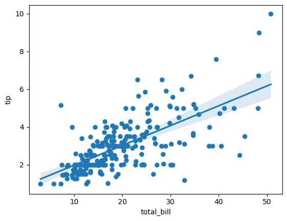
    


```python
sns.scatterplot(x = 'total_bill', 
                y = 'tip', 
                hue = 'sex',
                size = 'size',
                sizes = (50, 200),
                data = tips)

plt.xlabel('Total bill')
plt.ylabel('Tip')
plt.title('Relationship between Total Bill and Tip')
plt.show()
```


    
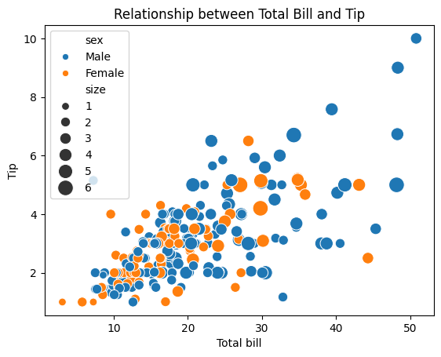
    


### Line Plots
* used to visualize trends in data over time or other continuous variables
* each data point is connected by a line, creating a smooth curve


```python
fmri = sns.load_dataset("fmri")
fmri.head()
```


<table border="1" class="dataframe">
  <thead>
    <tr style="text-align: right;">
      <th></th>
      <th>subject</th>
      <th>timepoint</th>
      <th>event</th>
      <th>region</th>
      <th>signal</th>
    </tr>
  </thead>
  <tbody>
    <tr>
      <th>0</th>
      <td>s13</td>
      <td>18</td>
      <td>stim</td>
      <td>parietal</td>
      <td>-0.017552</td>
    </tr>
    <tr>
      <th>1</th>
      <td>s5</td>
      <td>14</td>
      <td>stim</td>
      <td>parietal</td>
      <td>-0.080883</td>
    </tr>
    <tr>
      <th>2</th>
      <td>s12</td>
      <td>18</td>
      <td>stim</td>
      <td>parietal</td>
      <td>-0.081033</td>
    </tr>
    <tr>
      <th>3</th>
      <td>s11</td>
      <td>18</td>
      <td>stim</td>
      <td>parietal</td>
      <td>-0.046134</td>
    </tr>
    <tr>
      <th>4</th>
      <td>s10</td>
      <td>18</td>
      <td>stim</td>
      <td>parietal</td>
      <td>-0.037970</td>
    </tr>
  </tbody>
</table>


```python
sns.lineplot(x="timepoint", y="signal", data=fmri)
plt.show()
```


    
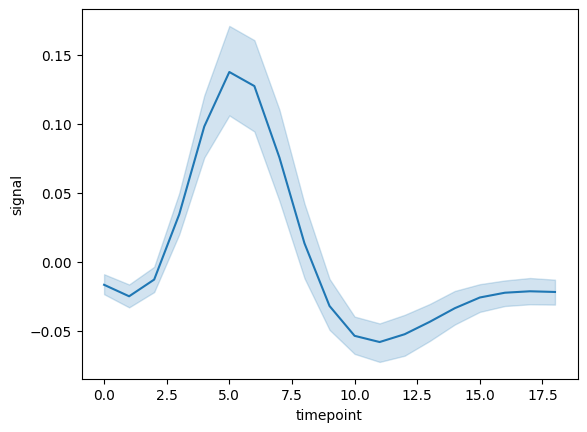
    


```python
sns.lineplot(x = 'timepoint', 
             y = 'signal', 
             hue = 'event', # Grouping variable that will produce lines with different colors
             style = 'region', # Grouping variable that will produce lines with different dashes and/or markers
             markers = True, # Setting to False will draw marker-less lines
             dashes = False, # Setting to False will use solid lines for all subsets
             errorbar = None, # Disable the error bars
             data = fmri # Input data structure
            )

plt.legend(bbox_to_anchor = (1.05, 1), loc = 'upper left', borderaxespad = 0) # move legend outside of plot
plt.xlabel('Timepoint')
plt.ylabel('Signal Intensity')
plt.title('Changes in Signal Intensity over Time')

plt.show()
```


    
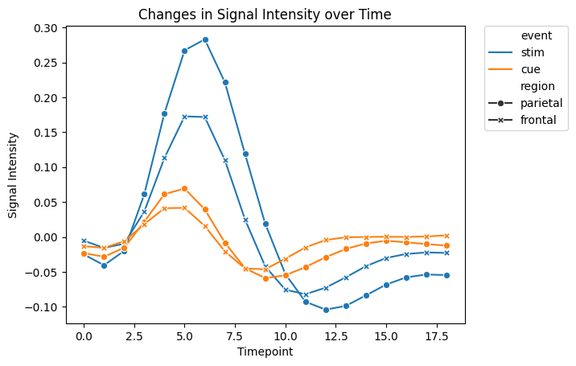
    


### Bar Plot
* used to visualize the relationship between a categorical variable and a continuous variable
* each bar represents the mean or median (or any aggregation) of the continuous variable for each category


```python
titanic = sns.load_dataset('titanic')
titanic.head()
```


<table border="1" class="dataframe">
  <thead>
    <tr style="text-align: right;">
      <th></th>
      <th>survived</th>
      <th>pclass</th>
      <th>sex</th>
      <th>age</th>
      <th>sibsp</th>
      <th>parch</th>
      <th>fare</th>
      <th>embarked</th>
      <th>class</th>
      <th>who</th>
      <th>adult_male</th>
      <th>deck</th>
      <th>embark_town</th>
      <th>alive</th>
      <th>alone</th>
    </tr>
  </thead>
  <tbody>
    <tr>
      <th>0</th>
      <td>0</td>
      <td>3</td>
      <td>male</td>
      <td>22.0</td>
      <td>1</td>
      <td>0</td>
      <td>7.2500</td>
      <td>S</td>
      <td>Third</td>
      <td>man</td>
      <td>True</td>
      <td>NaN</td>
      <td>Southampton</td>
      <td>no</td>
      <td>False</td>
    </tr>
    <tr>
      <th>1</th>
      <td>1</td>
      <td>1</td>
      <td>female</td>
      <td>38.0</td>
      <td>1</td>
      <td>0</td>
      <td>71.2833</td>
      <td>C</td>
      <td>First</td>
      <td>woman</td>
      <td>False</td>
      <td>C</td>
      <td>Cherbourg</td>
      <td>yes</td>
      <td>False</td>
    </tr>
    <tr>
      <th>2</th>
      <td>1</td>
      <td>3</td>
      <td>female</td>
      <td>26.0</td>
      <td>0</td>
      <td>0</td>
      <td>7.9250</td>
      <td>S</td>
      <td>Third</td>
      <td>woman</td>
      <td>False</td>
      <td>NaN</td>
      <td>Southampton</td>
      <td>yes</td>
      <td>True</td>
    </tr>
    <tr>
      <th>3</th>
      <td>1</td>
      <td>1</td>
      <td>female</td>
      <td>35.0</td>
      <td>1</td>
      <td>0</td>
      <td>53.1000</td>
      <td>S</td>
      <td>First</td>
      <td>woman</td>
      <td>False</td>
      <td>C</td>
      <td>Southampton</td>
      <td>yes</td>
      <td>False</td>
    </tr>
    <tr>
      <th>4</th>
      <td>0</td>
      <td>3</td>
      <td>male</td>
      <td>35.0</td>
      <td>0</td>
      <td>0</td>
      <td>8.0500</td>
      <td>S</td>
      <td>Third</td>
      <td>man</td>
      <td>True</td>
      <td>NaN</td>
      <td>Southampton</td>
      <td>no</td>
      <td>True</td>
    </tr>
  </tbody>
</table>


```python
titanic.dtypes # the class column is a category data type
```


    survived          int64
    pclass            int64
    sex              object
    age             float64
    sibsp             int64
    parch             int64
    fare            float64
    embarked         object
    class          category
    who              object
    adult_male         bool
    deck           category
    embark_town      object
    alive            object
    alone              bool
    dtype: object


```python
df = titanic.groupby('class', observed = True).agg({'fare' : 'sum'}).reset_index()

plt.figure(figsize = (7, 5)) # 1.4 aspect ratio
sns.barplot(x = 'class', 
            y = 'fare', 
            errorbar = None,
            data = df)

plt.ylim((0, 20000)) # So that text annotations fit within plot

# Add value annotations to each column
for i in range(df.shape[0]):
    plt.text(x = df.iloc[i, 0], 
             y = df.iloc[i,1] + 300, 
             s = '$' + str(round(df.iloc[i,1],2)), 
             horizontalalignment = 'center'
            )

plt.show()
```


    
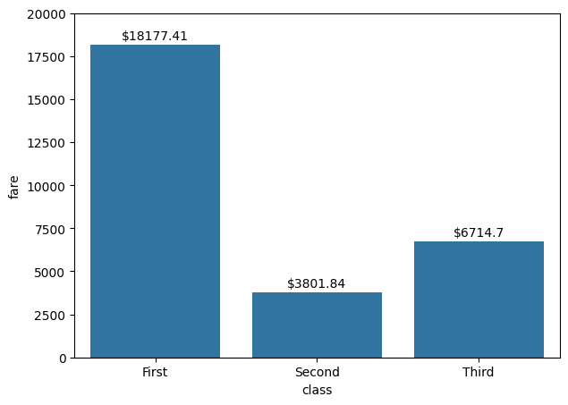
    


```python
# if data isn't aggregrated the mean value of the categories is used
titanic_order = (titanic.groupby('class', observed = True)
                        .agg({'fare' : 'mean'})
                        .sort_values(by = 'fare', ascending = True)    # sort in ascending or descending order
                        .reset_index()['class'])                       # select only the category column

sns.barplot(data = titanic,
            x = 'class', 
            y = 'fare', 
            errorbar = None,
            order = titanic_order    # use the order argument to sort the bar plot
            )
plt.show()
```


    
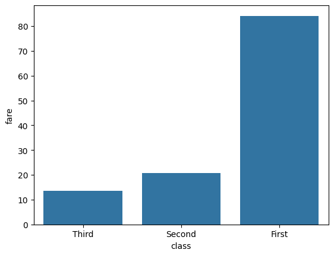
    


#### Horizontal bar plot
* Simply swap x and y to change the orientation of the bar plot.
* The `orient` parameter should be able to control this as well.
    * `'v'` vertical
    * `'h'` horizontal


```python
sns.barplot(data = titanic,
            y = 'class', 
            x = 'fare', 
            errorbar = None,
            order = titanic_order
            )
plt.show()
```


    
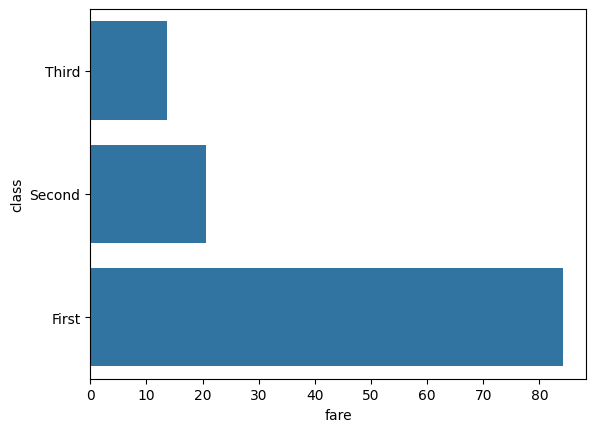
    


```python
titanic.groupby('class', observed = True).agg({'fare' : 'mean'}).reset_index()
```


<table border="1" class="dataframe">
  <thead>
    <tr style="text-align: right;">
      <th></th>
      <th>class</th>
      <th>fare</th>
    </tr>
  </thead>
  <tbody>
    <tr>
      <th>0</th>
      <td>First</td>
      <td>84.154687</td>
    </tr>
    <tr>
      <th>1</th>
      <td>Second</td>
      <td>20.662183</td>
    </tr>
    <tr>
      <th>2</th>
      <td>Third</td>
      <td>13.675550</td>
    </tr>
  </tbody>
</table>


#### Grouped Bar Plot


```python
sns.barplot(x = 'class', 
            y = 'fare', 
            hue = 'sex',
            errorbar = None,
            palette = 'muted',
            data = titanic)

plt.xlabel("Class")
plt.ylabel("Fare")
plt.title("Average Fare by Class and Gender on the Titanic")

plt.show()
```


    
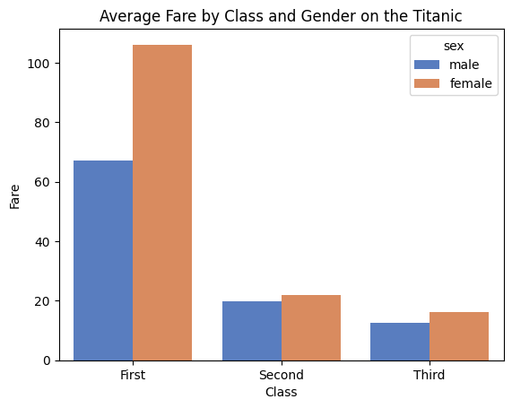
    


#### Stacked bar chart
* There is no direct method to do this in Seaborn
* The total bar can be drafted first and the lower bar drafted on top of that one
* The legend then needs to be manually created


```python
titanic_both = titanic.groupby('class', observed = True)['fare'].sum().reset_index() # the total sum

titanic_male = (titanic[titanic['sex'] == 'male']
                .groupby('class', observed = True)['fare']
                .sum()
                .reset_index()
               )

# the sum of both the male and female data
bar1 = sns.barplot(x = 'class', 
                   y = 'fare', 
                   color = sns.color_palette("muted")[1], # select individual colors from a palette
                   data = titanic_both
                  )
# the sum of only the male data that is drawn over the plot for both genders
bar2 = sns.barplot(x = 'class', 
                   y = 'fare', 
                   color = sns.color_palette("muted")[0], 
                   data = titanic_male)

plt.title('Total Fare by Class and Gender on the Titanic')
plt.xlabel("Class")
plt.ylabel("Fare")

# create legend
import matplotlib.patches as mpatches
top_bar = mpatches.Patch(color = sns.color_palette("muted")[0], label = 'male')
bottom_bar = mpatches.Patch(color = sns.color_palette("muted")[1], label = 'female')
plt.legend(handles = [top_bar, bottom_bar], title = 'Sex')

plt.show()
```


    
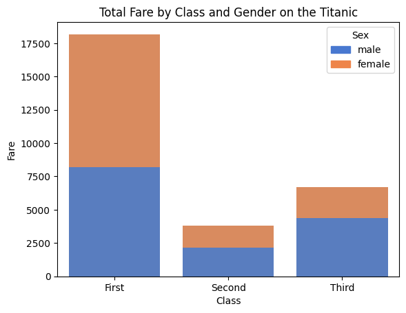
    


### Count Plot
* Show the counts of observations in each categorical bin using bars


```python
sns.countplot(data = titanic, x = 'class')
plt.show()
```


    
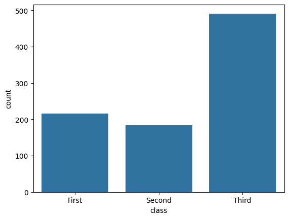
    


```python
sns.countplot(data = titanic, 
              x = 'class', 
              hue = 'survived', 
              stat = 'percent'    # ‘count’, ‘percent’, ‘proportion’, ‘probability’
             )
plt.show()
```


    
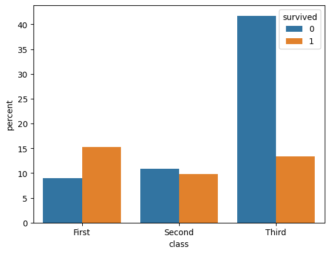
    


### Histogram
* visualize the distribution of a continuous variable
* the data is divided into bins
    * the height of each bin represents the frequency or count of data points within that bin


```python
iris = sns.load_dataset('iris')
iris.head()
```


<table border="1" class="dataframe">
  <thead>
    <tr style="text-align: right;">
      <th></th>
      <th>sepal_length</th>
      <th>sepal_width</th>
      <th>petal_length</th>
      <th>petal_width</th>
      <th>species</th>
    </tr>
  </thead>
  <tbody>
    <tr>
      <th>0</th>
      <td>5.1</td>
      <td>3.5</td>
      <td>1.4</td>
      <td>0.2</td>
      <td>setosa</td>
    </tr>
    <tr>
      <th>1</th>
      <td>4.9</td>
      <td>3.0</td>
      <td>1.4</td>
      <td>0.2</td>
      <td>setosa</td>
    </tr>
    <tr>
      <th>2</th>
      <td>4.7</td>
      <td>3.2</td>
      <td>1.3</td>
      <td>0.2</td>
      <td>setosa</td>
    </tr>
    <tr>
      <th>3</th>
      <td>4.6</td>
      <td>3.1</td>
      <td>1.5</td>
      <td>0.2</td>
      <td>setosa</td>
    </tr>
    <tr>
      <th>4</th>
      <td>5.0</td>
      <td>3.6</td>
      <td>1.4</td>
      <td>0.2</td>
      <td>setosa</td>
    </tr>
  </tbody>
</table>


```python
sns.histplot(x = 'petal_length', data = iris)
plt.show()
```


    
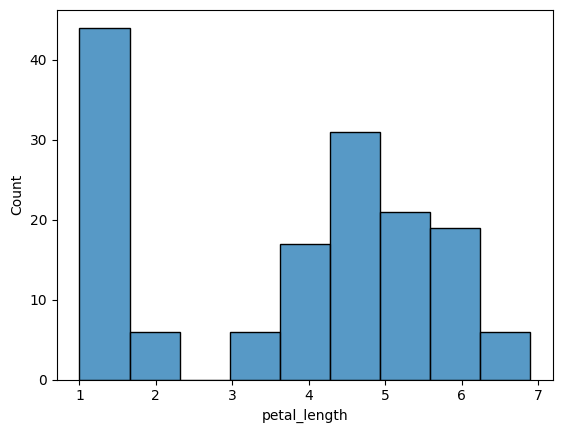
    


```python
sns.histplot(x = 'petal_length',
             bins = 20,
             # binwidth: Width of each bin, overrides bins
             kde = True, #  compute a kernel density estimate to smooth the distribution and show on the plot as (one or more) line(s)
             color = 'green', # Single color specification for when hue mapping is not used
             data = iris
            )

plt.xlabel("Petal Length (cm)")
plt.ylabel("Frequency")
plt.title("Distribution of Petal Lengths in Iris Flowers")

plt.show()
```


    
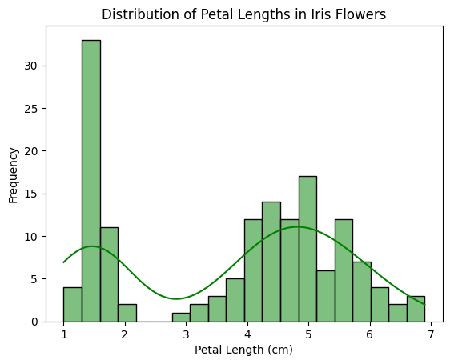
    


### Density Plot
* also known as kernel density plots
* display the distribution of a continuous variable
* similar to histograms
    * use a smooth curve to estimate the density of the data
    * instead of representing the data as bars


```python
sns.kdeplot(data = iris, 
            x = 'petal_length', 
            hue = 'species', 
            fill = True, 
            alpha = 0.6, 
            linewidth = 1.5, 
            palette = 'muted'
           )

plt.title("Density Plot of Petal Length by Species")
plt.xlabel("Petal Length (cm)")
plt.ylabel("Density")

plt.show()
```


    
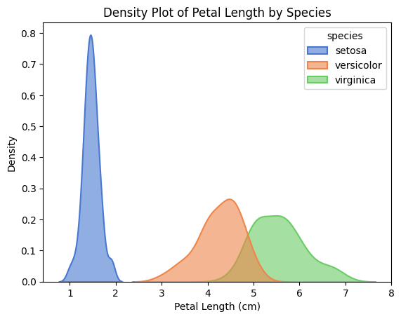
    


### Box Plot
* shows the distribution of a dataset
* commonly used to compare the distribution of one or more variables across different categories


```python
sns.boxplot(data = iris, 
            x = 'species', 
            y = 'petal_length', 
            hue = 'species',
            palette = 'muted',
            fliersize = 4,        # Size of outliers
            showfliers = True     # False to hide outliers
           )

plt.title('Box Plot of Petal Length by Species')
plt.xlabel('Species')
plt.ylabel('Petal Length (cm)')
plt.show()
```


    
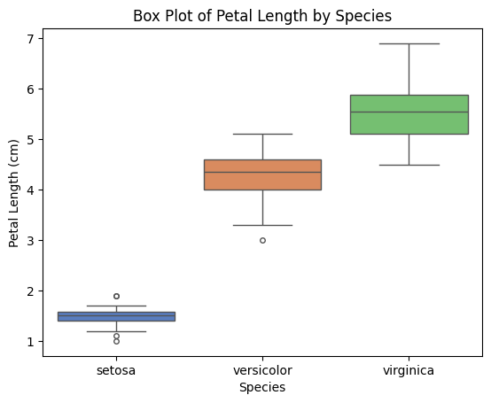
    


### Violin Plot
* combines aspects of both box plots and density plots
* displays a
    * density estimate of the data
        * usually smoothed by a kernel density estimator
    * the interquartile range (IQR)
        * a line within the violin
    * median
        * a white dot
* The width of the violin represents the density estimate
    * wider parts indicate higher density
* 


```python
sns.violinplot(data = iris, x = 'species', y = 'petal_length', hue = 'species')
plt.title('Violin Plot of Petal Length by Species')
plt.xlabel('Species')
plt.ylabel('Petal Length (cm)')
plt.show()
```


    
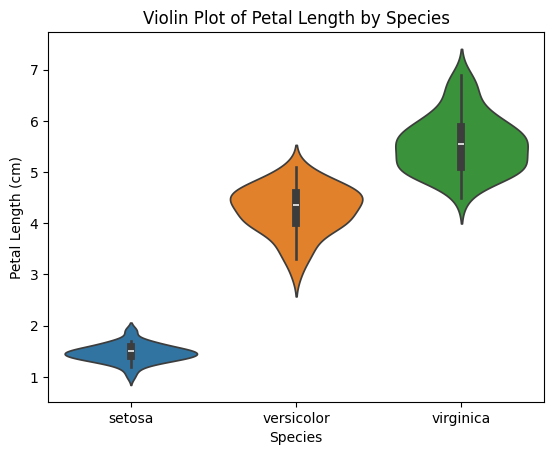
    


### Heatmap
* uses colors to depict the value of a variable in a two-dimensional space
* commonly used to visualize the correlation between different variables in a dataset


```python
iris.head()
```


<table border="1" class="dataframe">
  <thead>
    <tr style="text-align: right;">
      <th></th>
      <th>sepal_length</th>
      <th>sepal_width</th>
      <th>petal_length</th>
      <th>petal_width</th>
      <th>species</th>
    </tr>
  </thead>
  <tbody>
    <tr>
      <th>0</th>
      <td>5.1</td>
      <td>3.5</td>
      <td>1.4</td>
      <td>0.2</td>
      <td>setosa</td>
    </tr>
    <tr>
      <th>1</th>
      <td>4.9</td>
      <td>3.0</td>
      <td>1.4</td>
      <td>0.2</td>
      <td>setosa</td>
    </tr>
    <tr>
      <th>2</th>
      <td>4.7</td>
      <td>3.2</td>
      <td>1.3</td>
      <td>0.2</td>
      <td>setosa</td>
    </tr>
    <tr>
      <th>3</th>
      <td>4.6</td>
      <td>3.1</td>
      <td>1.5</td>
      <td>0.2</td>
      <td>setosa</td>
    </tr>
    <tr>
      <th>4</th>
      <td>5.0</td>
      <td>3.6</td>
      <td>1.4</td>
      <td>0.2</td>
      <td>setosa</td>
    </tr>
  </tbody>
</table>


```python
# the corr() dataframe method can calculate the correlation values between columns
df = iris.corr(numeric_only=True)
df
```


<table border="1" class="dataframe">
  <thead>
    <tr style="text-align: right;">
      <th></th>
      <th>sepal_length</th>
      <th>sepal_width</th>
      <th>petal_length</th>
      <th>petal_width</th>
    </tr>
  </thead>
  <tbody>
    <tr>
      <th>sepal_length</th>
      <td>1.000000</td>
      <td>-0.117570</td>
      <td>0.871754</td>
      <td>0.817941</td>
    </tr>
    <tr>
      <th>sepal_width</th>
      <td>-0.117570</td>
      <td>1.000000</td>
      <td>-0.428440</td>
      <td>-0.366126</td>
    </tr>
    <tr>
      <th>petal_length</th>
      <td>0.871754</td>
      <td>-0.428440</td>
      <td>1.000000</td>
      <td>0.962865</td>
    </tr>
    <tr>
      <th>petal_width</th>
      <td>0.817941</td>
      <td>-0.366126</td>
      <td>0.962865</td>
      <td>1.000000</td>
    </tr>
  </tbody>
</table>


```python
# the calculated correlations can be displayed using a heatmap
# to quickly show what columns are correlated with each other
sns.heatmap(df, cmap = 'Blues', annot = True)
plt.show()
```


    
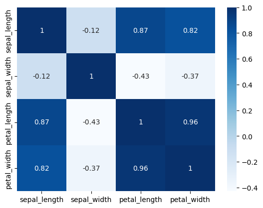
    


```python
flights = sns.load_dataset('flights')
flights
```


<table border="1" class="dataframe">
  <thead>
    <tr style="text-align: right;">
      <th></th>
      <th>year</th>
      <th>month</th>
      <th>passengers</th>
    </tr>
  </thead>
  <tbody>
    <tr>
      <th>0</th>
      <td>1949</td>
      <td>Jan</td>
      <td>112</td>
    </tr>
    <tr>
      <th>1</th>
      <td>1949</td>
      <td>Feb</td>
      <td>118</td>
    </tr>
    <tr>
      <th>2</th>
      <td>1949</td>
      <td>Mar</td>
      <td>132</td>
    </tr>
    <tr>
      <th>3</th>
      <td>1949</td>
      <td>Apr</td>
      <td>129</td>
    </tr>
    <tr>
      <th>4</th>
      <td>1949</td>
      <td>May</td>
      <td>121</td>
    </tr>
    <tr>
      <th>...</th>
      <td>...</td>
      <td>...</td>
      <td>...</td>
    </tr>
    <tr>
      <th>139</th>
      <td>1960</td>
      <td>Aug</td>
      <td>606</td>
    </tr>
    <tr>
      <th>140</th>
      <td>1960</td>
      <td>Sep</td>
      <td>508</td>
    </tr>
    <tr>
      <th>141</th>
      <td>1960</td>
      <td>Oct</td>
      <td>461</td>
    </tr>
    <tr>
      <th>142</th>
      <td>1960</td>
      <td>Nov</td>
      <td>390</td>
    </tr>
    <tr>
      <th>143</th>
      <td>1960</td>
      <td>Dec</td>
      <td>432</td>
    </tr>
  </tbody>
</table>
<p>144 rows × 3 columns</p>


```python
flights_pivoted = flights.pivot(columns = 'year', index = 'month', values = 'passengers')
flights_pivoted
```


<table border="1" class="dataframe">
  <thead>
    <tr style="text-align: right;">
      <th>year</th>
      <th>1949</th>
      <th>1950</th>
      <th>1951</th>
      <th>1952</th>
      <th>1953</th>
      <th>1954</th>
      <th>1955</th>
      <th>1956</th>
      <th>1957</th>
      <th>1958</th>
      <th>1959</th>
      <th>1960</th>
    </tr>
    <tr>
      <th>month</th>
      <th></th>
      <th></th>
      <th></th>
      <th></th>
      <th></th>
      <th></th>
      <th></th>
      <th></th>
      <th></th>
      <th></th>
      <th></th>
      <th></th>
    </tr>
  </thead>
  <tbody>
    <tr>
      <th>Jan</th>
      <td>112</td>
      <td>115</td>
      <td>145</td>
      <td>171</td>
      <td>196</td>
      <td>204</td>
      <td>242</td>
      <td>284</td>
      <td>315</td>
      <td>340</td>
      <td>360</td>
      <td>417</td>
    </tr>
    <tr>
      <th>Feb</th>
      <td>118</td>
      <td>126</td>
      <td>150</td>
      <td>180</td>
      <td>196</td>
      <td>188</td>
      <td>233</td>
      <td>277</td>
      <td>301</td>
      <td>318</td>
      <td>342</td>
      <td>391</td>
    </tr>
    <tr>
      <th>Mar</th>
      <td>132</td>
      <td>141</td>
      <td>178</td>
      <td>193</td>
      <td>236</td>
      <td>235</td>
      <td>267</td>
      <td>317</td>
      <td>356</td>
      <td>362</td>
      <td>406</td>
      <td>419</td>
    </tr>
    <tr>
      <th>Apr</th>
      <td>129</td>
      <td>135</td>
      <td>163</td>
      <td>181</td>
      <td>235</td>
      <td>227</td>
      <td>269</td>
      <td>313</td>
      <td>348</td>
      <td>348</td>
      <td>396</td>
      <td>461</td>
    </tr>
    <tr>
      <th>May</th>
      <td>121</td>
      <td>125</td>
      <td>172</td>
      <td>183</td>
      <td>229</td>
      <td>234</td>
      <td>270</td>
      <td>318</td>
      <td>355</td>
      <td>363</td>
      <td>420</td>
      <td>472</td>
    </tr>
    <tr>
      <th>Jun</th>
      <td>135</td>
      <td>149</td>
      <td>178</td>
      <td>218</td>
      <td>243</td>
      <td>264</td>
      <td>315</td>
      <td>374</td>
      <td>422</td>
      <td>435</td>
      <td>472</td>
      <td>535</td>
    </tr>
    <tr>
      <th>Jul</th>
      <td>148</td>
      <td>170</td>
      <td>199</td>
      <td>230</td>
      <td>264</td>
      <td>302</td>
      <td>364</td>
      <td>413</td>
      <td>465</td>
      <td>491</td>
      <td>548</td>
      <td>622</td>
    </tr>
    <tr>
      <th>Aug</th>
      <td>148</td>
      <td>170</td>
      <td>199</td>
      <td>242</td>
      <td>272</td>
      <td>293</td>
      <td>347</td>
      <td>405</td>
      <td>467</td>
      <td>505</td>
      <td>559</td>
      <td>606</td>
    </tr>
    <tr>
      <th>Sep</th>
      <td>136</td>
      <td>158</td>
      <td>184</td>
      <td>209</td>
      <td>237</td>
      <td>259</td>
      <td>312</td>
      <td>355</td>
      <td>404</td>
      <td>404</td>
      <td>463</td>
      <td>508</td>
    </tr>
    <tr>
      <th>Oct</th>
      <td>119</td>
      <td>133</td>
      <td>162</td>
      <td>191</td>
      <td>211</td>
      <td>229</td>
      <td>274</td>
      <td>306</td>
      <td>347</td>
      <td>359</td>
      <td>407</td>
      <td>461</td>
    </tr>
    <tr>
      <th>Nov</th>
      <td>104</td>
      <td>114</td>
      <td>146</td>
      <td>172</td>
      <td>180</td>
      <td>203</td>
      <td>237</td>
      <td>271</td>
      <td>305</td>
      <td>310</td>
      <td>362</td>
      <td>390</td>
    </tr>
    <tr>
      <th>Dec</th>
      <td>118</td>
      <td>140</td>
      <td>166</td>
      <td>194</td>
      <td>201</td>
      <td>229</td>
      <td>278</td>
      <td>306</td>
      <td>336</td>
      <td>337</td>
      <td>405</td>
      <td>432</td>
    </tr>
  </tbody>
</table>


```python
sns.heatmap(flights_pivoted, cmap = 'Blues', annot = True, fmt = 'd')
plt.title('Passengers per month')
plt.xlabel('Year')
plt.ylabel('Month')
plt.yticks(rotation = 0)
plt.show()
```


    
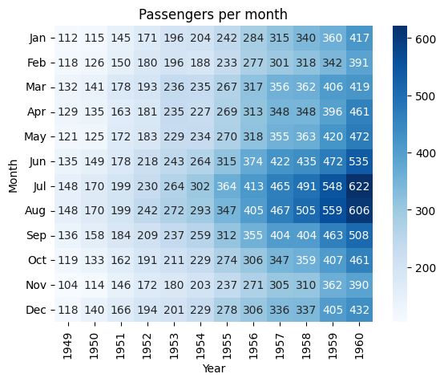
    


---

## Group plots

### Pair Plots
* multiple pairwise scatter plots are displayed in a matrix format
* Each scatter plot shows the relationship between two variables
* diagonal plots show the distribution of the individual variables


```python
sns.pairplot(data = iris)
plt.show()
```


    
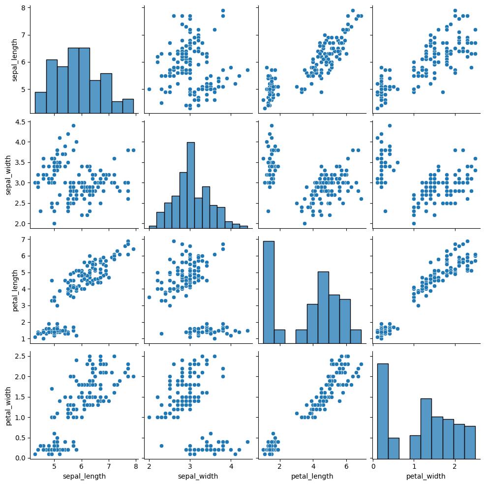
    


```python
sns.pairplot(data = iris, 
             hue = 'species', 
             diag_kind = 'kde', # ‘auto’, ‘hist’, ‘kde’, None 
             palette = 'muted'
            )
plt.title('Iris Dataset Pair Plot')
plt.show()
```


    
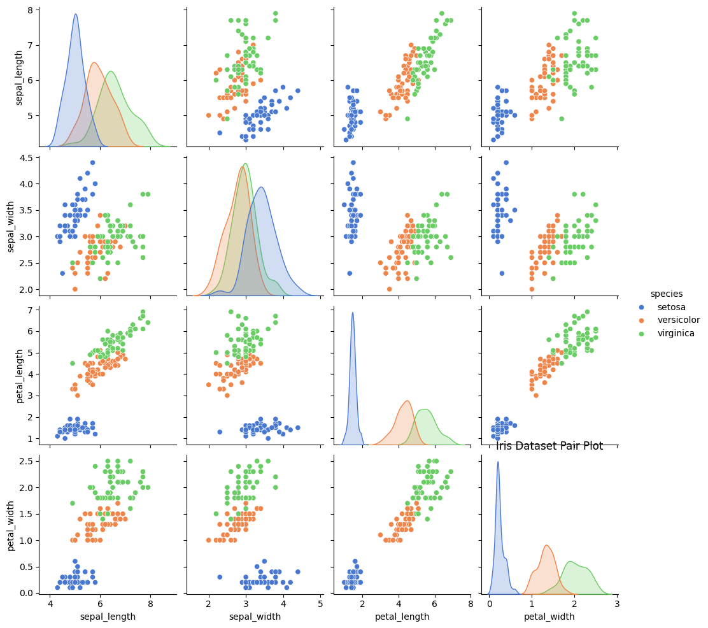
    


### Joint plot
* combines two different plots in one visualization
    * scatter plot
        * shows the relationship between two variables
    * histogram
        * shows the distribution of each individual variable
* shows the correlation between the two variables and their individual distributions


```python
sns.jointplot(data = iris, x = 'sepal_length', y = 'sepal_width')
plt.show()
```


    
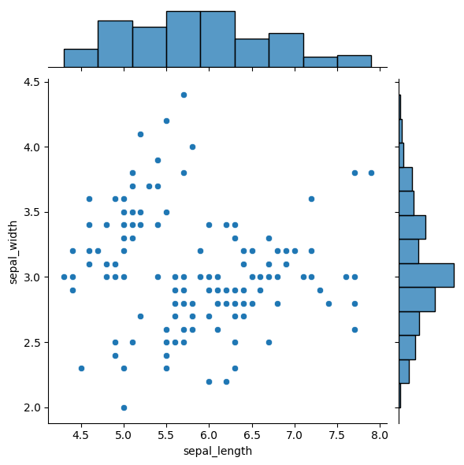
    


### Facet Grids
* allows you to visualize the distribution of one variable
    * as well as the relationship between two variables
    * across levels of additional categorical variables
* creates a grid of subplots based on the unique values in the categorical variable specified


```python
g = sns.FacetGrid(iris, col = 'species', hue = 'species')

g.map(sns.kdeplot, 'petal_length', fill = True, alpha = 0.6, linewidth = 1.5)
plt.show()
```


    
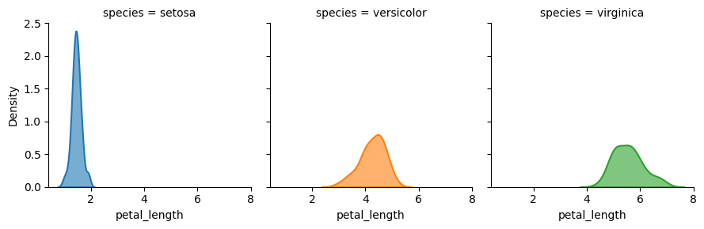
    


### Subplots
Use this when you want to look at different types of data side-by-side—for example, comparing a distribution to a relationship.


```python
fig, axes = plt.subplots(1, 2, figsize=(12, 5))

# Plot 1: Boxplot of petal length by species
sns.boxplot(data=iris, x="species", y="petal_length", ax=axes[0])
axes[0].set_title("Petal Length by Species")

# Plot 2: KDE plot of sepal width
sns.kdeplot(data=iris, x="sepal_width", hue="species", fill=True, ax=axes[1])
axes[1].set_title("Sepal Width Density")

plt.tight_layout()
```


    
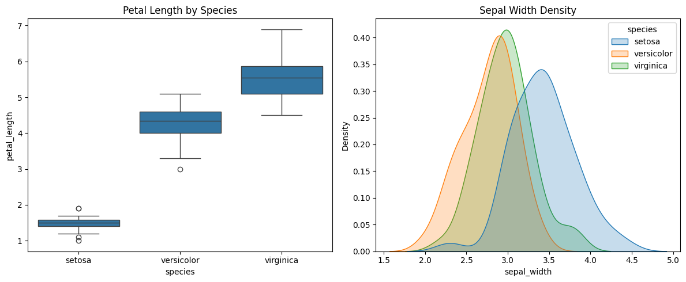
    


### relplot
A figure-level interface for visualizing statistical relationships between two variables using either scatter plots (default) or line plots


```python
sns.relplot(
    data=iris, 
    x="sepal_length", y="sepal_width", 
    col="species", hue="species",
    kind="scatter"
)
```


    <seaborn.axisgrid.FacetGrid at 0x7f3450d38b90>


    
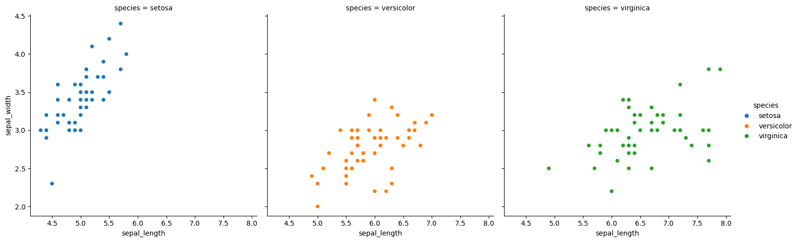
    


---

## Customizing With Matplotlib

### Adjust Plot Size
* use the `figure` method from matplotlib.pyplot
* pass a `figsize` argument equal to a tuple with the length and width


```python
plt.figure(figsize = (12.8,7.2))
plt.show()
```


    <Figure size 1280x720 with 0 Axes>


### Create Figure And Axis With Matplotlib


```python
fig, ax = plt.subplots(figsize=(8, 5))
```


    
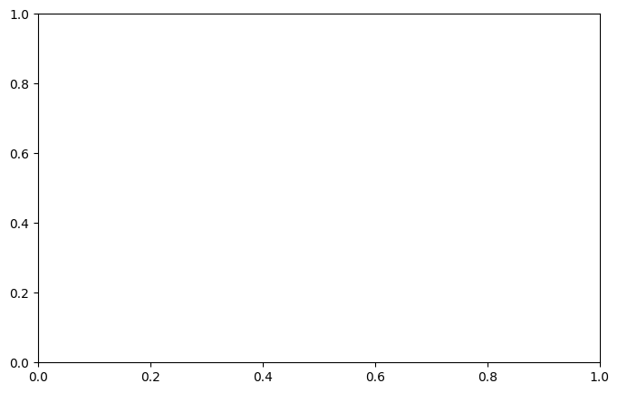
    


### Plot With Seaborn - Specifying The Axis


```python
fig, ax = plt.subplots(figsize=(8, 5))

sns.scatterplot(data=iris, x='sepal_length', y='sepal_width', hue='species', ax=ax)
plt.show()
```


    
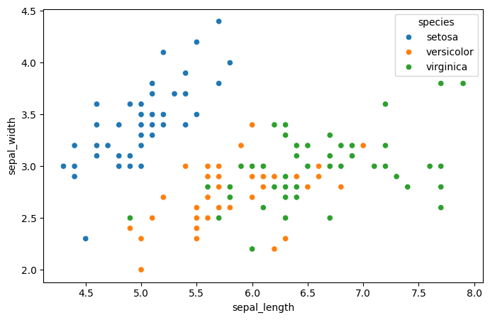
    


### Customize with Matplotlib (Referencing Axis)


```python
fig, ax = plt.subplots(figsize=(8, 5))

sns.scatterplot(data=iris, x='sepal_length', y='sepal_width', hue='species', ax=ax)
ax.set_title('Iris Sepal Dimensions', fontsize=14, loc='left', color='navy')

ax.set_xlabel('Length (cm)')
ax.set_ylabel('Width (cm)')
ax.set_xticks([3,4,5,6,7,8,9])
ax.tick_params(axis = 'y', labelrotation = 45)
plt.show()
```


    

    


### Customize with Matplotlib (No Axis)


```python
plt.figure(figsize=(8, 5))
sns.scatterplot(data=iris, x='sepal_length', y='sepal_width', hue='species')
plt.title('Iris Sepal Dimensions', fontsize=14, loc='left', color='navy')
plt.xlabel('Length (cm)')
plt.ylabel('Width (cm)')
plt.xticks([i for i in range(3,10)])
plt.yticks(rotation = 45)
plt.show()
```


    
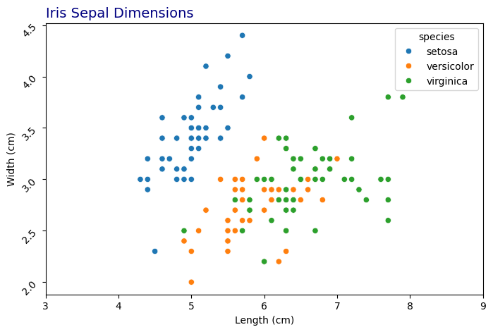
    


### Add annotations

You can use simple string codes for marker shapes: 

* . point (small circle)
* o circle (default)
* v triangle pointed down
* ^ triangle pointed up
* s square
* p pentagon
* \* star
* D diamond
* X thick x (filled)
* \+ plus  


```python
fig, ax = plt.subplots(figsize=(8, 5))
sns.scatterplot(data=iris, x='sepal_length', y='sepal_width', hue='species', legend = None, ax=ax)

# horizontal and vertical lines
plt.axhline(y = 3.0, linestyle = '--', c = 'red', alpha = 0.5)
plt.axvline(x = 7.0, linestyle = '--', c = 'red', alpha = 0.5)

# diagonal lines
# instead of x,y pairs you pass the x and y coordinates separately
x_points = np.array([7.25, 7.75])
y_points = np.array([4.0,4.5])
plt.plot(x_points, y_points, marker = None, linestyle = '-', color = 'red', alpha = 0.5)

plt.text(4.5, 4, 'Text', horizontalalignment='center', verticalalignment='center', fontsize = 16, color = 'red', alpha = 0.5)

# single points need to be enclosed in brackets
sns.scatterplot(x = [6.5], y = [4], color = 'red', marker = 'X', s = 200, alpha = 0.5, ax = ax)
plt.show()
```


    
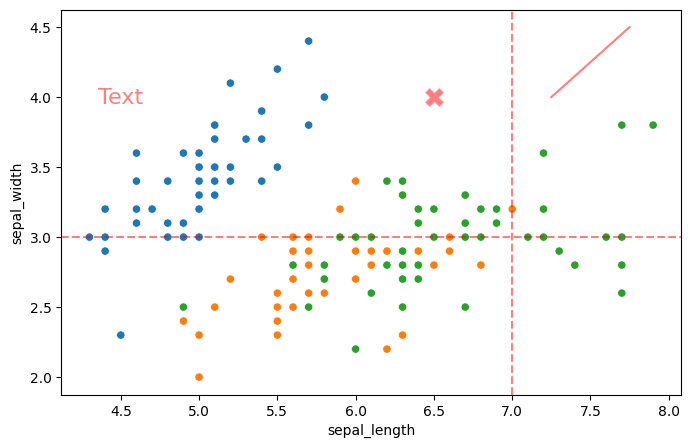
    


### Annotate Text Above A Barplot


```python
df = iris.groupby(by = 'species', observed = True, as_index = False).agg({'petal_length' : 'sum'})

plt.figure(figsize=(7,5))
sns.barplot(data = iris, x = 'species', y = 'petal_length', estimator = 'sum', errorbar = None)
plt.ylim(0,310)                                 # need to adjust the limits of the y-axis so the text labels aren't cut off
for i in range(df.shape[0]):
    plt.text(df.iloc[i,0], 
             df.iloc[i,1]+10,                   # move the text above the bar
             df.iloc[i,1], 
             horizontalalignment='center', 
             verticalalignment='center', 
             fontsize = 12, 
             color = sns.color_palette()[0],    # so the color matches the current palette
             alpha = 1.0)
plt.show()
```


    
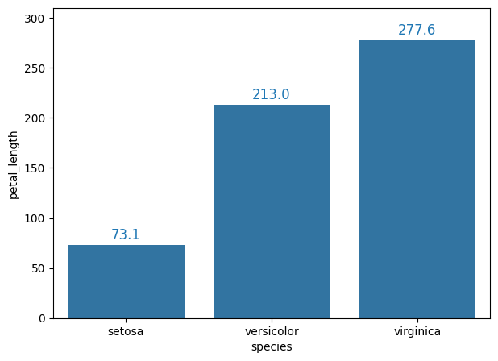
    


### Place Legend Outside The Plot To The Right
You can use Matplotlib’s legend method to move it outside the plot area.


```python
fig, ax = plt.subplots(figsize=(8, 5))
sns.scatterplot(data=iris, x='sepal_length', y='sepal_width', hue='species', ax=ax)
ax.legend(title='Iris Species', bbox_to_anchor=(1.05, 1), loc='upper left', borderaxespad=0.)
plt.show()
```


    
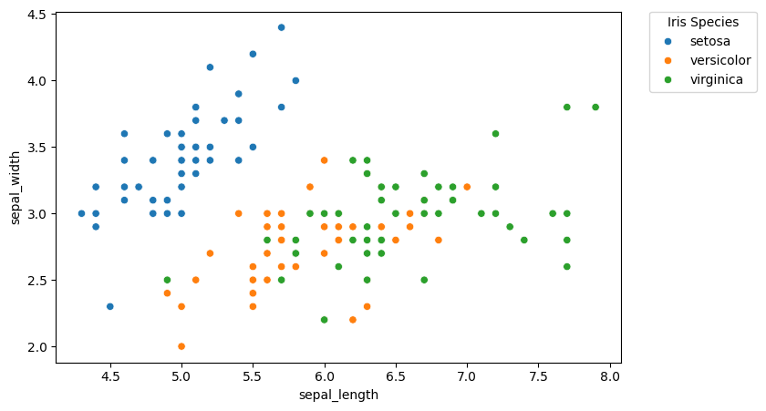
    


### Add text outside the plot


```python
fig, ax = plt.subplots(figsize=(8, 5))
sns.scatterplot(data=iris, x='sepal_length', y='sepal_width', hue='species', legend = None, ax=ax)
ax.text(1.02,1, 'Top right', transform=ax.transAxes,fontsize=12, verticalalignment='top', horizontalalignment='left')
ax.text(1.02,0, 'Bottom right', transform=ax.transAxes,fontsize=12, verticalalignment='bottom', horizontalalignment='left')
ax.text(-0.1,1, 'Top left', transform=ax.transAxes,fontsize=12, verticalalignment='top', horizontalalignment='right')
ax.text(-0.1,0, 'Bottom left', transform=ax.transAxes,fontsize=12, verticalalignment='bottom', horizontalalignment='right')
ax.text(0.5,1.1, 'Title', transform=ax.transAxes,fontsize=16, verticalalignment='center', horizontalalignment='center')
ax.text(1.0,-0.15, 'Dataset citation', transform=ax.transAxes,fontsize=10, fontstyle = 'italic', verticalalignment='center', horizontalalignment='right')

plt.xlabel('Sepal Length')
plt.ylabel('Sepal Width')
plt.title('Subtitle')   # the plot title can be used as a subtitle if text is placed above it for the title
plt.grid(True, alpha = 0.3)   # turn on grid lines
plt.show()
```


    
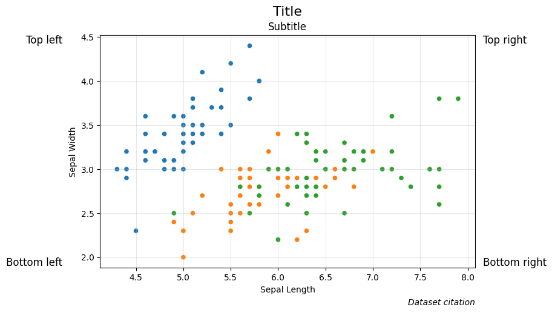
    


### Save Image

`plt.savefig('my_plot.png', dpi=300)`  
<br>

---

## Color palettes


```python
sns.color_palette()
```


<svg  width="550" height="55"><rect x="0" y="0" width="55" height="55" style="fill:#1f77b4;stroke-width:2;stroke:rgb(255,255,255)"/><rect x="55" y="0" width="55" height="55" style="fill:#ff7f0e;stroke-width:2;stroke:rgb(255,255,255)"/><rect x="110" y="0" width="55" height="55" style="fill:#2ca02c;stroke-width:2;stroke:rgb(255,255,255)"/><rect x="165" y="0" width="55" height="55" style="fill:#d62728;stroke-width:2;stroke:rgb(255,255,255)"/><rect x="220" y="0" width="55" height="55" style="fill:#9467bd;stroke-width:2;stroke:rgb(255,255,255)"/><rect x="275" y="0" width="55" height="55" style="fill:#8c564b;stroke-width:2;stroke:rgb(255,255,255)"/><rect x="330" y="0" width="55" height="55" style="fill:#e377c2;stroke-width:2;stroke:rgb(255,255,255)"/><rect x="385" y="0" width="55" height="55" style="fill:#7f7f7f;stroke-width:2;stroke:rgb(255,255,255)"/><rect x="440" y="0" width="55" height="55" style="fill:#bcbd22;stroke-width:2;stroke:rgb(255,255,255)"/><rect x="495" y="0" width="55" height="55" style="fill:#17becf;stroke-width:2;stroke:rgb(255,255,255)"/></svg>


### Display the hexadecimal value of the first color of the current palette


```python
sns.color_palette().as_hex()[0]
```


    '#1f77b4'


### Create a custom palette


```python
custom_palette = [sns.color_palette().as_hex()[7], sns.color_palette().as_hex()[7], sns.color_palette().as_hex()[0]]
custom_palette
```


    ['#7f7f7f', '#7f7f7f', '#1f77b4']


```python
plt.figure(figsize=(7,5))
sns.barplot(data = iris, 
            x = 'species', 
            y = 'petal_length', 
            estimator = 'sum', 
            hue = 'species', 
            errorbar = None, 
            palette=custom_palette)
plt.show()
```


    
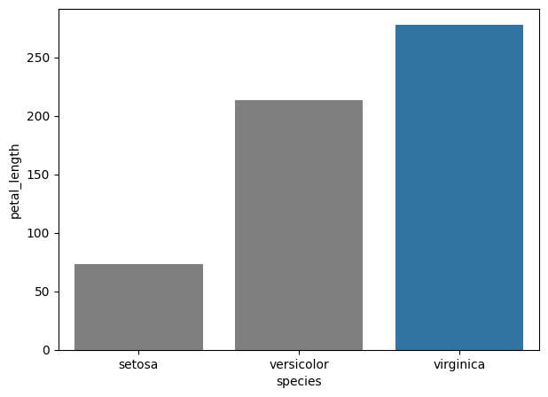
    


### Use an included palette


```python
plt.figure(figsize=(7,5))
sns.barplot(data = iris, 
            x = 'species', 
            y = 'petal_length', 
            estimator = 'sum', 
            hue = 'species', 
            errorbar = None, 
            palette='Set2')
plt.show()
```


    
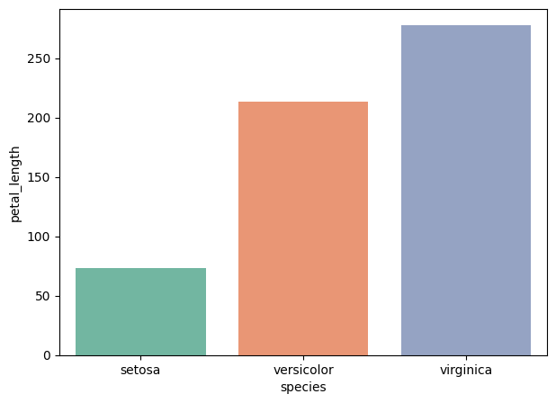
    

