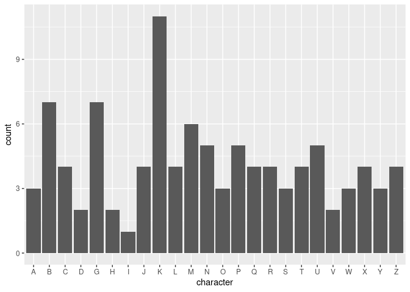
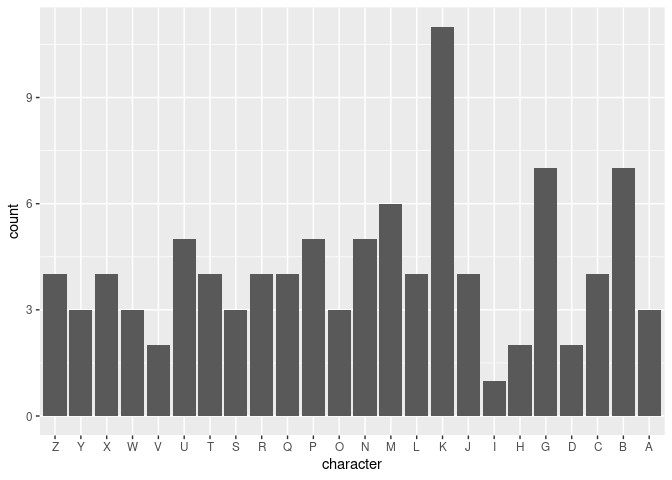
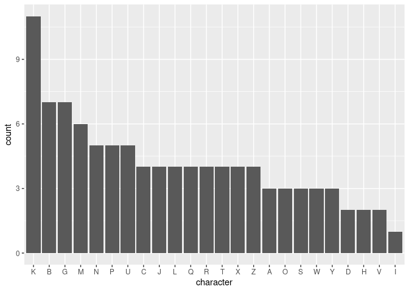
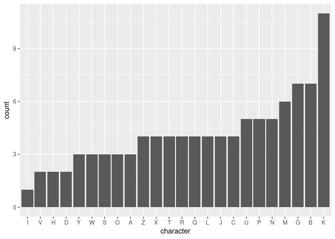
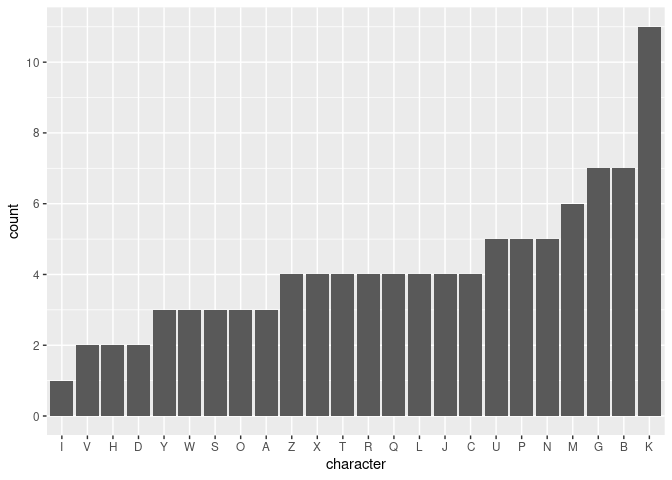

Factors
================
David Rommel
2025-06-22

# Load Libraries

The forcats package is used for the `fct_infreq()` and `fct_rev()`
functions.

``` r
library("tidyverse")
```

    ## ── Attaching core tidyverse packages ──────────────────────── tidyverse 2.0.0 ──
    ## ✔ dplyr     1.1.4     ✔ readr     2.1.5
    ## ✔ forcats   1.0.0     ✔ stringr   1.5.1
    ## ✔ ggplot2   3.5.2     ✔ tibble    3.3.0
    ## ✔ lubridate 1.9.4     ✔ tidyr     1.3.1
    ## ✔ purrr     1.0.4     
    ## ── Conflicts ────────────────────────────────────────── tidyverse_conflicts() ──
    ## ✖ dplyr::filter() masks stats::filter()
    ## ✖ dplyr::lag()    masks stats::lag()
    ## ℹ Use the conflicted package (<http://conflicted.r-lib.org/>) to force all conflicts to become errors

``` r
library("forcats")
```

# Create Data Frame

This code creates a data frame with a single column of random
characters.

``` r
char_df <- as_tibble(data.frame(character = c("B", "K", "J", "K", "N", "B", "K", "C", "Z",
                                    "V", "P", "R", "K", "X", "G", "P", "K", "L",
                                    "T", "T", "R", "Q", "K", "U", "C", "A", "B",
                                    "B", "M", "C", "K", "O", "U", "W", "U", "O",
                                    "M", "L", "H", "S", "J", "X", "T", "P", "G",
                                    "R", "Q", "S", "N", "V", "M", "G", "Y", "I",
                                    "W", "M", "R", "U", "X", "K", "N", "M", "P",
                                    "K", "O", "C", "G", "B", "P", "G", "B", "Z",
                                    "T", "Q", "K", "K", "J", "B", "Z", "L", "A",
                                    "N", "M", "Z", "W", "L", "X", "N", "Y", "S",
                                    "A", "G", "Y", "H", "J", "D", "U", "D", "G",
                                    "Q")))
```

# Edit Data Frame

By default the character column is created as a `chr` data type. In
order to sort the data for bar charts this column will need to be
converted to a factor.

    ## Rows: 100
    ## Columns: 1
    ## $ character <chr> "B", "K", "J", "K", "N", "B", "K", "C", "Z", "V", "P", "R", …

<br> The following code converts the character column to a factor data
type.

``` r
char_df$character <- as.factor(char_df$character)
```

<br> When the data is viewed now it is a `fct` data type.

    ## Rows: 100
    ## Columns: 1
    ## $ character <fct> B, K, J, K, N, B, K, C, Z, V, P, R, K, X, G, P, K, L, T, T, …

## Set the levels of a column

By default the factors seem to be sorted in alphabetical order, so this
code doesn’t appear to be needed.

``` r
char_df$character <- factor(char_df$character, 
                            levels = c("A", "B", "C", "D", "E", "F", "G", "H",
                                       "I", "J", "K", "L", "M", "N", "O", "P",
                                       "Q", "R", "S", "T", "U", "V", "W", "X",
                                       "Y", "Z"))
```

# Plot Data

This plots the counts for each character. The plot is automatically
ordered in ascending alphabetical order, even without setting the levels
explicitly in the previous code block.

``` r
char_df %>% ggplot() + geom_bar(mapping = aes(x = character))
```

<!-- --> <br><br>
To reverse the order of the x-axis you can use the `fct_rev()` function
from the forcats package.

``` r
char_df %>% ggplot() + geom_bar(mapping = aes(x = fct_rev(character))) +
  labs(x = "character")
```

<!-- --> <br><br>
To plot the character counts from highest to lowest you can use the
`fct_infreq()` function from the forcats package.

``` r
char_df %>% ggplot() + geom_bar(mapping = aes(x = fct_infreq(character))) + 
  labs(x = "character")
```

<!-- --> <br><br>
To plot the character counts from lowest to highest you can combine the
`fct_rev()` function with the `fct_infreq()` function.

``` r
char_df %>% ggplot() + geom_bar(mapping = aes(x = fct_rev(fct_infreq(character)))) + 
  labs(x = "character")
```

<!-- --> <br><br>
To reorder data with an x and y-value for a `geom_col()` plot use the
`fct_reorder()` function. The second argument of this function is the
column to reorder by.

``` r
char_df %>% group_by(character) %>% summarize(count = n()) %>% 
  ggplot() + geom_col(mapping = aes(x = fct_reorder(character, count), y = count)) + 
  labs(x = "character")
```

<!-- -->

<br><br> You can also use the factor functions in the `mutate()`
function to edit the data before plotting it.

``` r
char_df %>% mutate(character = character %>% fct_infreq() %>% fct_rev()) %>%
  ggplot() + geom_bar(mapping = aes(x = character))
```

<!-- --> <br>

## Change scale of axes

You can change the scale of continuous values using
`scale_y_continuous()` or `scale_x_continuous()`. You can format axes
with dates using the date version of the function.
`scale_x_date(date_breaks = "1 month", date_labels = "%b %Y")`

``` r
char_df %>% mutate(character = character %>% fct_infreq() %>% fct_rev()) %>%
  ggplot() + geom_bar(mapping = aes(x = character)) +
  scale_y_continuous(breaks = seq(0, 12, by = 2))
```

<!-- -->

## Create categories

The `count()` function creates a new column named n. The `case_when()`
function is used to categorize the data based on conditions.

``` r
char_df %>% count(character) %>% mutate(occurances = case_when(
  n <= 5 ~ "few",
  n > 5 ~ "many",
  .default = NA))
```

    ## # A tibble: 24 × 3
    ##    character     n occurances
    ##    <fct>     <int> <chr>     
    ##  1 A             3 few       
    ##  2 B             7 many      
    ##  3 C             4 few       
    ##  4 D             2 few       
    ##  5 G             7 many      
    ##  6 H             2 few       
    ##  7 I             1 few       
    ##  8 J             4 few       
    ##  9 K            11 many      
    ## 10 L             4 few       
    ## # ℹ 14 more rows

<br>

## Additional factor functions

Check levels of a column by using the `pull()` function on the column
followed by the `levels()` function.

``` r
char_df %>% pull(character) %>% levels()
```

    ##  [1] "A" "B" "C" "D" "E" "F" "G" "H" "I" "J" "K" "L" "M" "N" "O" "P" "Q" "R" "S"
    ## [20] "T" "U" "V" "W" "X" "Y" "Z"

<br> You can combine levels using the `fct_collapse()` function. The
following code groups characters A through G to a single factor.

``` r
char_df %>% mutate(char_collapse = fct_collapse(character, "A-G" = c("A","B","C","D","E","F","G"))) %>% 
  count(char_collapse)
```

    ## # A tibble: 20 × 2
    ##    char_collapse     n
    ##    <fct>         <int>
    ##  1 A-G              23
    ##  2 H                 2
    ##  3 I                 1
    ##  4 J                 4
    ##  5 K                11
    ##  6 L                 4
    ##  7 M                 6
    ##  8 N                 5
    ##  9 O                 3
    ## 10 P                 5
    ## 11 Q                 4
    ## 12 R                 4
    ## 13 S                 3
    ## 14 T                 4
    ## 15 U                 5
    ## 16 V                 2
    ## 17 W                 3
    ## 18 X                 4
    ## 19 Y                 3
    ## 20 Z                 4

<br> You can use `fct_other()` to combine everything except for a
specific factor to an *Other* factor.

``` r
char_df %>% mutate(char_other = fct_other(character, keep = "A")) %>% count(char_other)
```

    ## # A tibble: 2 × 2
    ##   char_other     n
    ##   <fct>      <int>
    ## 1 A              3
    ## 2 Other         97

<br> You can lump all but a certain number of factors with the highest
counts into a single factor named Other using the `fct_lump()` function.
The following code will lump all but the top 10 occurring characters
into a single category. Since some of the characters have the same
number of occurrences, the plot displays more than 10 values.

``` r
char_df %>% mutate(char_lump = fct_lump(character, n = 10)) %>% count(char_lump)
```

    ## # A tibble: 16 × 2
    ##    char_lump     n
    ##    <fct>     <int>
    ##  1 B             7
    ##  2 C             4
    ##  3 G             7
    ##  4 J             4
    ##  5 K            11
    ##  6 L             4
    ##  7 M             6
    ##  8 N             5
    ##  9 P             5
    ## 10 Q             4
    ## 11 R             4
    ## 12 T             4
    ## 13 U             5
    ## 14 X             4
    ## 15 Z             4
    ## 16 Other        22

<br> You can lump factors that have fewer than a certain number of
occurrences using the `fct_lump_min()` function. The following code
lumps all of the factors that have less than 6 occurrences into a factor
named *Other*..

``` r
char_df %>% mutate(char_lump_min = fct_lump_min(character, min = 6)) %>% count(char_lump_min)
```

    ## # A tibble: 5 × 2
    ##   char_lump_min     n
    ##   <fct>         <int>
    ## 1 B                 7
    ## 2 G                 7
    ## 3 K                11
    ## 4 M                 6
    ## 5 Other            69
