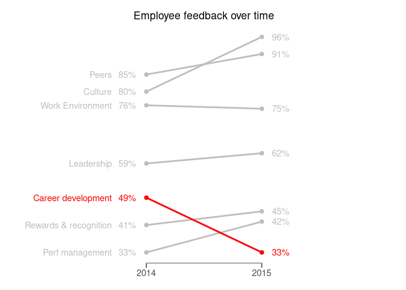

Slopegraphs
================
David Rommel
2025-07-11

## Load libraries

``` r
library("tidyverse")
```

## Create sample data set

The following data set contains the percent of employees who responded
favorably to various categories in a survey. The data covers two years,
2014 and 2015. A slope graph can quickly illustrate the relative changes
from 2014 to 2015 for each of the categories.

``` r
df2 <- data.frame(
  category = c("Peers", "Peers", "Culture", "Culture", "Work Environment", 
               "Work Environment", "Leadership", "Leadership", "Career development",
               "Career development", "Rewards & recognition", "Rewards & recognition", 
               "Perf management", "Perf management"),
  year = c(2014,2015,2014,2015,2014,2015,2014,2015,2014,2015,2014,2015,2014,2015),
  percent_favorable = c(85,91,80,96,76,75,59,62,49,33,41,45,33,42)
)
```

    ##                 category year percent_favorable
    ## 1                  Peers 2014                85
    ## 2                  Peers 2015                91
    ## 3                Culture 2014                80
    ## 4                Culture 2015                96
    ## 5       Work Environment 2014                76
    ## 6       Work Environment 2015                75
    ## 7             Leadership 2014                59
    ## 8             Leadership 2015                62
    ## 9     Career development 2014                49
    ## 10    Career development 2015                33
    ## 11 Rewards & recognition 2014                41
    ## 12 Rewards & recognition 2015                45
    ## 13       Perf management 2014                33
    ## 14       Perf management 2015                42

<br> The data will likely initially be in a wider format with the years
in separate columns.

``` r
df3 <- df2 %>% pivot_wider(names_from = year, values_from = percent_favorable)
```

    ## # A tibble: 7 × 3
    ##   category              `2014` `2015`
    ##   <chr>                  <dbl>  <dbl>
    ## 1 Peers                     85     91
    ## 2 Culture                   80     96
    ## 3 Work Environment          76     75
    ## 4 Leadership                59     62
    ## 5 Career development        49     33
    ## 6 Rewards & recognition     41     45
    ## 7 Perf management           33     42

<br> If that is the case, use the `pivot_longer()` function to put the
`year` and `percent_favorable` values into individual columns.

``` r
df3 <- df3 %>% pivot_longer(cols = c(`2014`, `2015`), names_to = "year", values_to = "percent_favorable")
```

## Create the slope graph

The slope graph uses `geom_line()` and `geom_point()` to create the
basic graph. The x-axis scale is adjusted with `scale_y_continuous()`
function the so that it just contains the two years.

The `geom_text()` objects shift the data over and makes the lines
narrower since they are placed a year before and after the plotted data.
The `hjust` attribute is then used to position the percentages next to
the lines. The category label text is just positioned by adjusting the
mapping x attribute until it is an appropriate distance from the
percentage. The `hjust` attribute is set to `"right"` to right align the
text. All of these values will need to be adjusted depending on the size
you are exporting the plot as.

The tick marks are made longer and a annotation segment is drawn
connecting them to create the time scale.

The colors are manually adjusted to emphasize individual lines(s). The
levels were set at the beginning, using the `mutate()` function, and
`Career development` was placed at the end so that it is drawn last and
on top of the other categories.

Various elements are adjusted and hidden using the `theme()` function.

``` r
df2 %>% mutate(category = factor(category, levels = c("Peers", "Culture", "Work Environment", 
                                                      "Leadership", "Rewards & recognition", 
                                                      "Perf management", "Career development"))) %>%
  ggplot() + 
  geom_line(mapping = aes(x = year, y = percent_favorable, color = category), linewidth = 1) + 
  geom_point(mapping = aes(x = year, y = percent_favorable, color = category), size = 2) + 
  geom_text(data = df2 %>% filter(year == 2014), mapping = aes(x = 2013, 
                                                               y = percent_favorable, 
                                                               label = paste0(percent_favorable,"%"), 
                                                               color = category), hjust = -5) +
  geom_text(data = df2 %>% filter(year == 2015), mapping = aes(x = 2016, 
                                                               y = percent_favorable, 
                                                               label = paste0(percent_favorable,"%"), 
                                                               color = category), hjust = 6) + 
  geom_text(data = df2 %>% filter(year == 2014), mapping = aes(x = 2013.7, 
                                                               y = percent_favorable, 
                                                               label = category, 
                                                               color = category), hjust = "right") + 
  labs(title = "Employee feedback over time") + 
  annotate(geom = "segment", x = 2014, xend = 2015, y = -Inf, yend = -Inf) + 
  scale_x_continuous(breaks = c(2014, 2015), position = "bottom") +
  scale_color_manual(values = c("grey", "grey", "grey", "grey", "grey", "grey", "red")) + 
  theme(
    legend.position = "none", 
    plot.margin = unit(c(0.5,0.5,0.5,0.5), "cm"),
    plot.title = element_text(hjust = 0.5),
    panel.background = element_blank(),
    axis.title = element_blank(),
    axis.text.x = element_text(size = 11),
    axis.text.y = element_blank(),
    axis.ticks.y = element_blank(),
    axis.ticks.length.x = unit(2, "mm")
  )
```

<!-- -->
