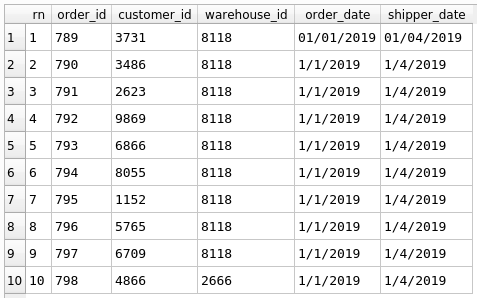
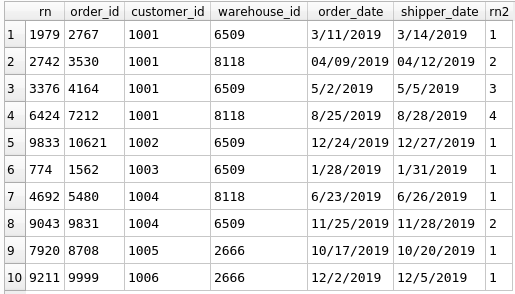

## Generate Row Numbers
Use the `row_number() OVER ()` function to generate unique row numbers for each row of a query.  Adding a row 
number column is useful for data cleaning, since it allows you to evaluate and keep/remove individual rows.
```sql
SELECT
	row_number() OVER () AS rn,
	*
FROM 
	Orders
LIMIT 
	10
```
<!-- -->

You can group/partition the row numbers by one or more columns.  To do this add the `PARTITION BY` argument, followed by the 
column(s) you wish to group data by, in the `OVER ()` function.  The following query generates a new set of row numbers, starting 
at 1 for each customer.

```sql
WITH temp_table AS (
SELECT
	row_number() OVER () AS rn,
	*
FROM 
	Orders
)
	
SELECT
	*,
	row_number() OVER (PARTITION BY customer_id) AS rn2
FROM 
	temp_table
ORDER BY
	customer_id
LIMIT
  10
```
<!-- -->
